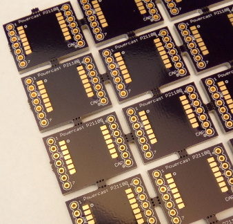

# Breakout board for Powercast P2110 module to 0.100'' pins

Useful for connecting a [Powercast
P2110](http://www.powercastco.com/products/powerharvester-receivers/) module to
a breadboard or to 0.100'' headers for connecting jumper wires.

This repository contains Eagle design files for the schematic and board layout.
